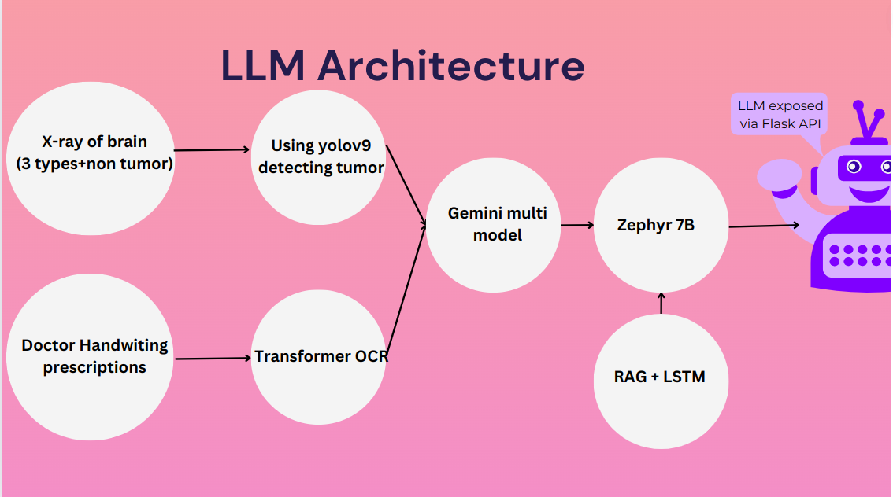
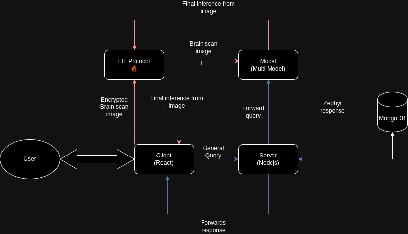

# Lit

## Short Description

A secure AI-powered healthcare assistant offering encrypted consultations, prescription interpretation, and brain scan analysis.


## Description

Document is a secure chatbot with a friendly browser-user interface to introduce more privacy in healthcare, and ease the workloads of doctors.
It allows users to ask queries related to brain-tumour, and get an answer. It's better than most LLMs nowadays due to fine-tuning over a RAG model. The model also supports object detection and inference of brain tumors. Upload brain scan images, and the model will identify and return if the scan has any variety of tumors. The main concern, Privacy is solved using LIT Protocol by encrypting the image, and then interacting with the model.

## How it's made

The project uses @LitProtocol's Decrypt within an Action to provide extra security. Instead of executing and calling the model on a server, the execution and response are returned inside a secure and trusted LIT Action. 
On the frontend, it utilizes React with Vite to provide an easy User Interface, on the backend we have a Node.js server running. 
The model was built on Google Collab run through flask-api and hosted by ngrok.  
For our LLM models, we have used a combination of Zephy + Gemini as a RAG model to improve accuracy. For object detection, we have yolov9 model, which passes its inference into the Gemini model for NLP.


## LLM Architecture




## APP Architecture




## RUN LOCALLY

### Client

1. Install the dependencies using ```npm install``
2. Create a duplicate of `.env.example` and rename to `.env` and populate the env file.
3. Run ```npm run dev``.

### Server

1. Install the dependencies using ```npm install``
2. Create a duplicate of `.env.example` and rename to `.env` and populate the env file.
3. Run ```npm run dev``.


### Model

1. Upload the jupyter notebook on colab to run and host.